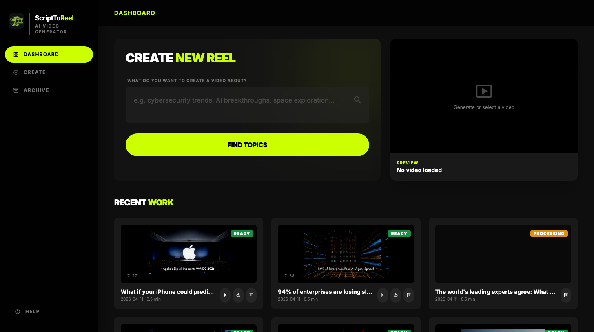

<div align="center">

<!-- PNG: GitHub README often blocks or drops huge filter+embedded-raster SVGs; keep in sync via rsvg-convert from scripttoreel-logo.svg -->


# ScriptToReel

**Turn a topic into a 1080p MP4** — local AI pipeline on **macOS Apple Silicon**: SDXL image generation, OpenRouter LLM script, Kokoro/edge-tts voiceover, Freesound audio, and **FFmpeg** (VideoToolbox when available).

[](https://www.python.org/)
[](#prerequisites)
[](https://ffmpeg.org/)
[](https://openrouter.ai/)

[Architecture](docs/ARCHITECTURE.md) · [Dev plan](PLAN.md) · [Dashboard](#optional-web-dashboard)

<br/>

[](#optional-web-dashboard)

<sub>Local dashboard · <code>python server.py</code> → <code>http://localhost:8080</code></sub>

</div>

---

**New here?** Install prerequisites → copy `config/api_keys.env.example` → run the [First-time checklist](#first-time-checklist) below.

**Branding:** Primary lockup `scripttoreel-logo.svg` (Gemini export); vector mark and app icon (`mark.svg`, `app-icon.svg`); stacked wordmark and light/dark / monochrome variants in `assets/branding/`. Legacy Wikimedia reel: `app-icon-legacy.svg`. See `assets/branding/README.md`.

---

## Features

- **End-to-end pipeline** — Six modules from research → metadata → script & voice → orchestration → render → validation.
- **Local SDXL images** — Stable Diffusion XL runs on Apple MPS; no stock photo API needed for visuals.
- **Freesound audio** — Ambient SFX and music downloaded from Freesound (free API key).
- **OpenRouter LLM** — Any model via [openrouter.ai](https://openrouter.ai) (Claude, GPT-4o, Llama, etc.). One API key, no local GPU for LLM.
- **AI Director** — Pre-production plan → script review (ScriptDirector) → visual coherence pass (VisualDirector).
- **Hook Engine** — 12 proven hook patterns; LLM selects the best opener and prepends it to the intro.
- **Kokoro TTS** — ONNX-based neural TTS; falls back to **edge-tts** → **macOS `say`** if unavailable.
- **Pro export** — **1920×1080**, 30 fps, H.264 (**VideoToolbox** / **libx264** fallback), AAC stereo, BT.709 MP4.
- **Human in the loop** — Edit `orchestration.json` before re-render to tune scenes and timing.
- **Optional dashboard** — `python server.py` → **http://localhost:8080** over the same CLI pipeline.

---

## Prerequisites

| Requirement | Notes |
|-------------|--------|
| **macOS Apple Silicon** | Developed on M4 Pro. Intel Mac may work but SDXL MPS acceleration won't apply. |
| **Python** | **3.12+** recommended. |
| **FFmpeg + ffprobe** | `brew install ffmpeg` — needed for metadata, render, validation. |
| **OpenRouter API key** | Required for script generation. Free tier available at [openrouter.ai](https://openrouter.ai). Set `OPENROUTER_API_KEY` in `config/api_keys.env`. |
| **Freesound API key** | Optional. Free at [freesound.org/apiv2/apply](https://freesound.org/apiv2/apply/). Without it, audio assets are skipped. |

---

## Installation

```bash
git clone https://github.com/tanveerriaz/scripttoreel.git
cd scripttoreel

# Recommended: virtual environment
python3 -m venv .venv
source .venv/bin/activate

pip install -r requirements.txt
```

Verify tools:

```bash
python main.py --help
ffmpeg -version
```

---

## First-time checklist

1. **API template** — `cp config/api_keys.env.example config/api_keys.env`
2. **OpenRouter key** — Add `OPENROUTER_API_KEY=<your-key>` to `config/api_keys.env`. Optionally set `OPENROUTER_MODEL` (default: `anthropic/claude-sonnet-4-5`).
3. **Freesound key** (optional) — Add `FREESOUND_API_KEY=<your-key>` for ambient audio.
4. **Create a project** — `python main.py --init --topic "Your topic" --duration 5`
5. **Run the pipeline** — `python main.py --run --project <project_id>`
6. **Output** — `projects/<project_id>/output/final_video.mp4`

Edit `projects/<project_id>/orchestration.json` before a re-render to tweak scenes or timing (Module 4 output).

---

## How it works

Six **modules** run in order; each reads/writes JSON (and media) under `projects/<id>/`. Contracts are **Pydantic** models in `src/utils/json_schemas.py`.

For a diagram and file-by-file map, see **[docs/ARCHITECTURE.md](docs/ARCHITECTURE.md)**.

---

## Quick Start (reference)

```bash
# 1. Dependencies
pip install -r requirements.txt

# 2. Keys
cp config/api_keys.env.example config/api_keys.env
# → add OPENROUTER_API_KEY (required), FREESOUND_API_KEY (optional)

# 3. New project
python main.py --init --topic "Haunted Places in Pakistan" --duration 5

# 4. Full pipeline
python main.py --run --project haunted_places_in_pakistan

# 5. Status / validate
python main.py --status --project haunted_places_in_pakistan
python main.py --validate --project haunted_places_in_pakistan
```

Video path: `projects/<project_id>/output/final_video.mp4`

---

## Optional: web dashboard

```bash
source .venv/bin/activate   # if you use a venv
python server.py
```

Open **http://localhost:8080** — browser UI over the same CLI pipeline.

---

## API Keys

Copy the template: `cp config/api_keys.env.example config/api_keys.env`, then edit **`config/api_keys.env`** (gitignored — never commit it).

| Key | Required | Where to get it |
|-----|----------|----------------|
| `OPENROUTER_API_KEY` | **Yes** | [openrouter.ai](https://openrouter.ai) — free tier available |
| `OPENROUTER_MODEL` | No | Default: `anthropic/claude-sonnet-4-5` |
| `FREESOUND_API_KEY` | No | [freesound.org/apiv2/apply](https://freesound.org/apiv2/apply/) |

---

## CLI Reference

```
python main.py --init --topic "TOPIC" --duration MINUTES
    Create a new project directory and production plan

python main.py --run --project PROJECT_ID
    Run all 6 modules end-to-end

python main.py --module N --project PROJECT_ID
    Run a single module (1-6)

python main.py --status --project PROJECT_ID
    Show pipeline progress table

python main.py --validate --project PROJECT_ID
    Run Module 6 quality validation only
```

---

## Pipeline Modules

| Module | What it does |
|--------|-------------|
| **1 — Research** | SDXL local image generation + Freesound audio download → `assets_raw.json` |
| **2 — Metadata** | ffprobe + Pillow + librosa + OpenCV → enriches assets → `assets.json` |
| **3 — Script+TTS** | OpenRouter LLM → script JSON; AI Director review pass; Kokoro/edge-tts → `script.json`, `voiceover.wav` |
| **4 — Orchestration** | Asset matching, timeline, transitions, VisualDirector coherence pass → `orchestration.json` (**human edit point**) |
| **5 — Render** | MoviePy scene build (Ken Burns, color grade, vignette, title card), FFmpeg audio mix → `output/final_video.mp4` |
| **6 — Validation** | 10 ffprobe checks + metadata embedding → `validation_report.json` |

---

## Project Directory Structure

```
projects/my_project/
├── project.json            ← metadata + pipeline status
├── production_plan.json    ← AI Director pre-production plan
├── assets_raw.json         ← Module 1
├── assets.json             ← Module 2
├── script.json             ← Module 3
├── orchestration.json      ← Module 4 — edit before re-render
├── validation_report.json
├── assets/
│   ├── raw/                ← SDXL images, Freesound audio
│   └── audio/              ← per-segment voiceover WAVs
└── output/
    └── final_video.mp4
```

---

## Output Specs

- Resolution: 1920×1080
- Frame rate: 30fps
- Video: H.264 (VideoToolbox on Apple Silicon, **libx264** fallback)
- Audio: AAC 192kbps stereo
- Color: BT.709
- Container: MP4, `faststart` for streaming

---

## Troubleshooting

**OpenRouter key missing**

```
Error: OPENROUTER_API_KEY is not set in config/api_keys.env
```

→ Add `OPENROUTER_API_KEY=<your-key>` to `config/api_keys.env`. Get a free key at [openrouter.ai](https://openrouter.ai).

**TTS fallback chain**

Kokoro ONNX → edge-tts → macOS `say`. If Kokoro model files are absent the pipeline silently falls through to the next available engine.

**No audio assets**

Add `FREESOUND_API_KEY` to `config/api_keys.env`, or accept music-free output from Module 5.

**VideoToolbox missing**

Pipeline falls back to **libx264**. Check: `ffmpeg -encoders | grep videotoolbox`

**SDXL first run slow**

Model weights (~6 GB) are downloaded on first use and cached in `~/.cache/huggingface/`.

---

## Running Tests

```bash
python3 -m pytest tests/ -v
```
